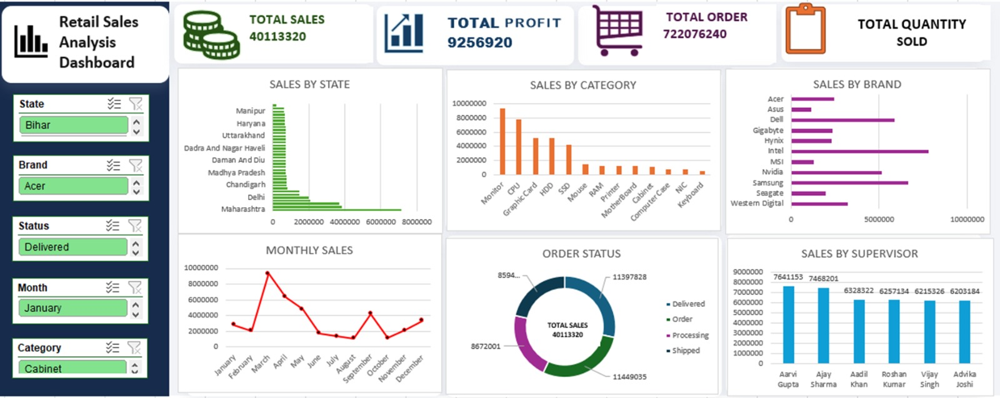

# Retail Sales Analysis Dashboard (Microsoft Excel)

## Project Overview
This project demonstrates the end-to-end process of transforming raw retail sales data into an interactive dashboard using Microsoft Excel. The dataset was cleaned by removing duplicates, handling missing values, correcting inconsistent text formatting, standardizing date formats, and validating data types to ensure data accuracy and consistency.

After cleaning, Pivot Tables, Pivot Charts and  Slicers were used to create an interactive dashboard that helps analyze key business metrics such as Total Sales, Total Profit, Total Orders, Quantity Sold, Sales by Category, Sales by State, Monthly Sales Trends, and Sales by Supervisor. The dashboard enables users to explore insights through dynamic filtering and supports data-driven decision-making.

---

## Tools Used

- Microsoft Excel
- Pivot Tables
- Pivot Charts
- Slicers
- Conditional Formatting

---

## Dataset

The dataset contains sales transaction data including:

- Order Number
- Customer Name
- State
- Order Date
- Status
- Product
- Category
- Quantity
- Brand
- Cost
- Sales
- Profit
- Year
- Month
- Assigned Supervisor
- Profit Margin


---


## 🧹 Data Cleaning

The following data cleaning steps were performed in **Microsoft Excel** to prepare the dataset for analysis:

* Removed duplicate records.
* Removed blank and incomplete rows.
* Standardized **Order Date** into a consistent Excel date format.
* Corrected inconsistent text formatting using **TRIM** and **PROPER** functions.
* Standardized **Customer Names**.
* Standardized **Product**, **Category**, and **Brand** names.
* Corrected inconsistent **State** values.
* Standardized **Order Status** values.
* Converted **Sales**, **Cost**, and **Quantity** columns to appropriate numeric formats.
* Removed unnecessary spaces and special characters.
* Checked for missing values and handled them where required.
* Verified data types for all columns.
* Ensured the dataset was clean, consistent, and ready for analysis and dashboard creation.


---

## Dashboard Features

The dashboard includes:

- KPI Cards
  - Total Sales
  - Total Orders
  - Total Profit
  - Total Quantity

- Monthly Sales Trend

- Sales by Category

- Sales by State

- Sales by Brand

- Order Sales

- Sales by Supervisor

---

## Excel Features Used


- TRIM
- PROPER
- IFERROR
- DATE
- Pivot Tables
- Pivot Charts
- Slicers
- Conditional Formatting


---

## Project Structure

```
 Retail-Sales-Analysis-Dashboard
│──  Dataset
│     └── Retail_Sales_Dataset.xlsx
│
│──  Dashboard
│     └── Retail_Sales_Analysis_Dashboard.xlsx
│
│──  Screenshots
│     ├── Dashboard_.png
│     
│
│── README.md

```

---

## Dashboard Preview



---

## Outcome

The final dashboard provides an interactive view of retail sales performance using KPI Cards, Pivot Charts,  and Slicers. Users can dynamically filter the data to analyze Total Sales, Total Profit, Total Orders, Quantity Sold, Sales by Category, Sales by State, Monthly Sales Trends, and Sales by Supervisor, enabling faster business insights and informed decision-making.

---

## Project Highlights

✔ Cleaned and transformed raw retail sales data

✔ Built an interactive Excel dashboard

✔ Used Pivot Tables, Pivot Charts, Slicers, and Timeline

✔ Created KPI Cards for Sales, Profit, Orders, and Quantity

✔ Enabled dynamic filtering for business analysis

✔ Generated actionable insights from sales data

---


## Author

Your Name : Shreeya Sapate

GitHub :https://github.com/shreeyasapate

LinkedIn: